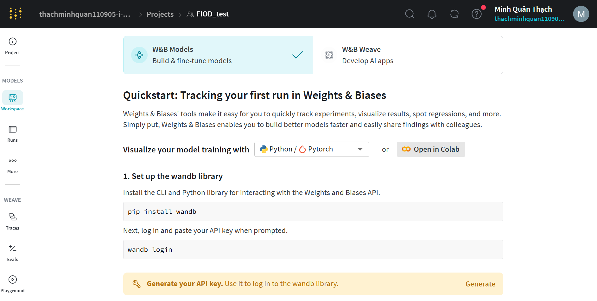

# Fog-Pass Filtering to Learn Fog-Invariant Features in Object Detectors
___
This repository contains the code for our paper "Fog-Pass Filtering to Learn Fog-Invariant Features in Object Detectors".

Here is the instruction to run our method:

## Step 1: Prepare the dataset
1. Download the Cityscapes and FoggyCityscapes datasets: https://www.cityscapes-dataset.com/
2. Prepare the object detection annotations for both datasets following YOLO format with 2 classes:
- 0: "person"
- 1: "car"
3. Organize the dataset directory as follows and place it in the folder `data/`:
```
data/
├── CW/
│   ├── images/
│   │   ├── train/
│   │   ├── val/
│   └── labels/
│   │   ├── train/
│   │   ├── val/
└── SF/
    ├── images/
    │   ├── train/
    │   ├── val/
    └── labels/
        ├── train/
        ├── val/
```

## Step 2: Create wandb account and set up API key
1. Create an account on [Weights & Biases](https://wandb.ai/site), create a project and generate an API key.
2. Install the wandb library:
```bash
pip install wandb
```
3. Log in and paste your API key:
```bash
wandb login
```


## Step 3: Train the model
1. Install the required dependencies:
```bash
pip install -r requirements.txt
```
2. Configure the training parameters in `train_config.py` (e.g., arg.gpu).
3. Run the training script:
```bash
python main.py
```